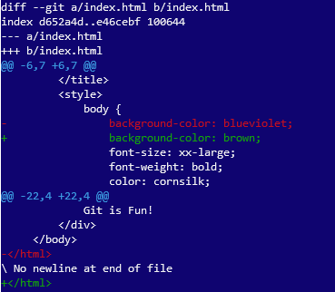

```{r setup, include=FALSE}
knitr::opts_chunk$set(echo = TRUE, eval = FALSE)
```

## Basic CLI commands

- `cd` - change directory
- `mkdir` - make a new directory
- `ls` or `dir` - list directory contents
- `rm` or `del` - delete one or more files

```{bash}
$ mkdir my-repo
$ cd my-repo
```


## git clone
For **grabbing** a remote repo

```{bash}
$ git clone https://github.com/BroVic/my-repo.git
Cloning into 'my-repo'...
remote: Enumerating objects: 3, done.
remote: Counting objects: 100% (3/3), done.
remote: Compressing objects: 100% (2/2), done.
remote: Total 3 (delta 0), reused 3 (delta 0), pack-reused 0
Unpacking objects: 100% (3/3), done.
Checking connectivity... done.
$
```


## git status
Check the current status of a git repo

```{bash}
$ git status
fatal: Not a git repository (or any of the parent directories): .git
```


## git configure

- Provide personal settings so that Git knows who you are. 
- Obligatory with fresh installations

To check  
```{bash}
$ git config --get user.name
$ git config --get user.email
```


To set  
```{bash}
$ git config --global user.name "User Gitter"
$ git config --global user.email "user.gitter@myemail.com"
```

## git init

To initialize or create a Git repo (locally)

```{bash}
$ git init
Initialized empty Git repository in C:/Users/Admn/Documents/project/my-repo/.git/
$ git status
On branch master

Initial commit

nothing to commit (create/copy files and use "git add" to track)
```

## git remote
Related to working with the remote repo  

```{bash}
$ git remote add origin https://github.com/BroVic/my-repo.git
```

To check the remote repo
```{bash}
$ git remote -v
origin  https://github.com/BroVic/my-repo.git (fetch)
origin  https://github.com/BroVic/my-repo.git (push)
```

## git push
After committing changes, you can push them to a remote repo.

```{bash}
$ git push origin master
```

## git branch
To work with branches

```{bash}
$ git branch
* master
$ git branch dev
$ git branch
  dev
* master
```

---

To change to another branch use the `checkout` option

```{bash}
$ git checkout dev
Switched to branch 'dev'
$ git branch
* dev
  master
```

## git pull

This is a 2-in-1 operation

* `git fetch`
* `git merge`

Let's say we made a change on the remote repo...  
Check if you want to include locally (Good practice!)  

---

```{bash}
$ git fetch origin master
remote: Enumerating objects: 5, done.
remote: Counting objects: 100% (5/5), done.
remote: Compressing objects: 100% (2/2), done.
remote: Total 3 (delta 1), reused 0 (delta 0), pack-reused 0
Unpacking objects: 100% (3/3), done.
From https://github.com/BroVic/my-repo
 * branch            master     -> FETCH_HEAD
   f8ee478..2bdf16e  master     -> origin/master
```

---

Use `git diff` to check the changes

<center></center>

---

If satisfied with changes, do a `git merge`

```{bash}
$ git merge
Updating f8ee478..2bdf16e
Fast-forward
 index.html | 4 ++--
 1 file changed, 2 insertions(+), 2 deletions(-)
```

## Finally, `git help`

```{bash}
$ git help
usage: git [--version] [--help] [-C <path>] [-c name=value]
           [--exec-path[=<path>]] [--html-path] [--man-path] [--info-path]
           [-p | --paginate | --no-pager] [--no-replace-objects] [--bare]
           [--git-dir=<path>] [--work-tree=<path>] [--namespace=<name>]
           <command> [<args>]

These are common Git commands used in various situations:

start a working area (see also: git help tutorial)
   clone      Clone a repository into a new directory
   ...
   ...
```

---

To find help for a given command, do `git help <command> and a manual page will open in your console or browser

```{bash}
$ git help clone
Launching default browser to display HTML ...
```

